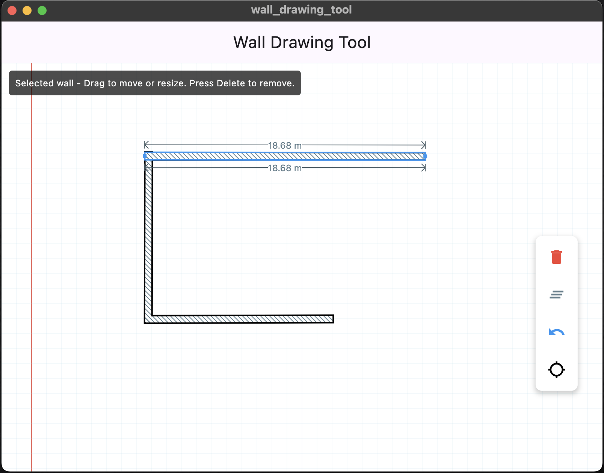

# Floorplan 3D - Wall Drawing Tool

A powerful Flutter application for creating 2D floorplans with real-time 3D visualization. This tool allows architects, interior designers, and DIY enthusiasts to quickly sketch room layouts and instantly see them in 3D.





 


## ✨ Features

### 🎨 Drawing & Editing
- **Intuitive Wall Creation**: Tap and drag to draw walls with real-time preview
- **Precision Controls**: Snap-to-grid and snap-to-endpoint functionality
- **Wall Manipulation**: Move, resize, and rotate walls with handles
- **Measurement Guides**: Real-time length measurements in meters with visual guides
- **Diagonal Patterns**: Visual wall fill patterns for better visibility

### 🛠️ Advanced Tools
- **Undo/Redo Support**: Multi-level undo/redo functionality
- **Selection System**: Click to select walls with visual highlighting
- **Delete & Clear**: Remove individual walls or clear entire designs
- **Draggable Toolbar**: Customizable floating toolbar with position persistence
- **Accessibility**: Full screen reader support with semantic labels

### 🌟 3D Visualization
- **3D Toggle**: Switch between 2D and 3D views instantly
- **Interactive 3D**: Drag to rotate and explore your floorplan in 3D space
- **Ground Grid**: Visual reference grid for spatial orientation
- **Real-time Updates**: Changes in 2D immediately reflect in 3D view

### 📱 Multi-Platform Support
- **Mobile**: Android and iOS with touch-optimized interface
- **Desktop**: Windows, macOS, and Linux with mouse/keyboard support
- **Web**: Browser-based access with Chrome optimization

## 🚀 Getting Started

### Prerequisites

- **Flutter SDK**: Version 3.0.0 or higher
- **Development Environment**:
  - Android Studio or VS Code with Flutter/Dart plugins
  - Chrome browser (for web development)
- **Platform-specific requirements**:
  - Android: USB debugging enabled or emulator
  - iOS: Xcode and iOS simulator
  - Desktop: Flutter desktop support enabled

### Installation

1. **Clone the repository**
   ```bash
   git clone <repository-url>
   cd floorplan_3d
   ```

2. **Install dependencies**
   ```bash
   flutter pub get
   ```

3. **Run the application**

   **Android:**
   ```bash
   flutter run
   ```

   **iOS:**
   ```bash
   flutter run
   ```

   **Web:**
   ```bash
   flutter run -d chrome
   ```

   **Windows:**
   ```bash
   flutter run -d windows
   ```

   **macOS:**
   ```bash
   flutter run -d macos
   ```

   **Linux:**
   ```bash
   flutter run -d linux
   ```

### Troubleshooting

- **No devices found**: Ensure USB debugging is enabled (Android) or Xcode is configured (iOS)
- **Build errors**: Run `flutter doctor` to diagnose setup issues
- **Web issues**: Ensure Chrome is installed and updated
- **Channel issues**: Use stable Flutter channel: `flutter channel stable`

## 🎯 Usage Guide

### Basic Drawing
1. **Create Walls**: Tap and drag on the canvas to draw walls
2. **Select Walls**: Tap on any wall to select it (highlighted in blue)
3. **Move Walls**: Drag selected walls to reposition them
4. **Resize Walls**: Use the blue handles at wall endpoints to resize

### Advanced Features
1. **Snap to Grid**: Toggle the magnet icon to enable/disable grid snapping
2. **Measurement**: Selected walls show real-time length measurements
3. **3D View**: Click the 3D cube icon to toggle 3D visualization
4. **Toolbar Customization**: Drag the toolbar to your preferred position

### Keyboard Shortcuts
- **Delete/Backspace**: Remove selected wall
- **Escape**: Deselect current wall
- **Tab**: Cycle through toolbar options

## 🏗️ Project Structure

```
lib/
├── main.dart              # Main application entry point
├── main-bkup.dart        # Backup of main application
├── backup/               # Development backup files
│   ├── milestone1.dart   # Initial implementation
│   ├── wall_move.dart    # Wall movement logic
│   └── ...              # Various development stages
└── milestones/          # Milestone implementations
    ├── milestone1.dart  # Basic wall drawing
    ├── milestone2.dart  # Measurement guides
    ├── milestone13.dart # 3D visualization
    └── ...             # Complete feature progression
```

## 🔧 Technical Architecture

### Core Components

- **WallDrawingController**: State management with Riverpod
- **Wall Model**: Mathematical representation of walls with transformations
- **Custom Painters**: Efficient rendering of walls, patterns, and guides
- **Gesture System**: Multi-touch support for drawing and manipulation

### Key Dependencies

- **flutter_riverpod**: State management
- **shared_preferences**: Local storage for preferences
- **uuid**: Unique identifier generation

### Performance Optimizations

- **Path Merging**: Combined wall paths for efficient rendering
- **Cached Painting**: Minimized repaints through smart invalidation
- **Gesture Optimization**: Smooth interaction handling

## 📊 Measurement System

The application uses a precise measurement system:
- **Pixels per Meter**: 20.0 px/m conversion ratio
- **Real-time Updates**: Measurements update during manipulation
- **Visual Guides**: Measurement lines with arrow indicators
- **Text Orientation**: Automatic text rotation for readability

## 🎨 UI/UX Design

### Visual Elements
- **Color Scheme**: Professional blue and grey palette
- **Grid Background**: Light blue grid for spatial reference
- **Selection Indicators**: Blue highlighting and handles
- **Toolbar**: Floating, draggable control panel

### Accessibility Features
- **Screen Reader Support**: Semantic labels for all interactive elements
- **High Contrast**: Clear visual differentiation
- **Touch Targets**: Generous touch areas for mobile use

## 🔄 Development Milestones

The project evolved through 13 major milestones:

1. **Basic Wall Drawing** - Foundation
2. **Measurement Guides** - Precision tools  
3. **Diagonal Patterns** - Visual enhancement
4. **Wall Selection** - Interactive elements
5. **Measurement Arrows** - Improved UX
6. **Enhanced Selection** - Refined interaction
7. **Wall Manipulation** - Move and resize
8. **Wall Merging** - Combined geometry
9. **Dragging Improvements** - Smooth operation
10. **Snap-to-Grid** - Precision alignment
11. **Toolbar Persistence** - User preferences
12. **State Management** - Code refactoring
13. **3D Visualization** - Immersive view

## 🤝 Contributing

We welcome contributions! Please follow these steps:

1. Fork the repository
2. Create a feature branch (`git checkout -b feature/amazing-feature`)
3. Commit your changes (`git commit -m 'Add amazing feature'`)
4. Push to the branch (`git push origin feature/amazing-feature`)
5. Open a Pull Request

### Development Guidelines

- Follow Dart style guidelines
- Write comprehensive tests
- Update documentation for new features
- Maintain backward compatibility

## 📝 License

This project is licensed under the MIT License - see the [LICENSE](LICENSE) file for details.

## 🙏 Acknowledgments

- Flutter team for the amazing framework
- Riverpod for state management solutions
- Open source community for inspiration and tools

## 📞 Support

If you have any questions or need help:

- Create an issue on GitHub
- Check the existing documentation
- Review the milestone progression files

## 🚀 Future Enhancements

Planned features for future releases:
- Room detection and labeling
- Furniture library and placement
- Export to CAD formats
- Collaborative editing
- VR/AR visualization
- Material and texture application
- Lighting simulation
- Cost estimation

---

**Happy Floorplanning!** 🏠✨

*Built with ❤️ using Flutter*